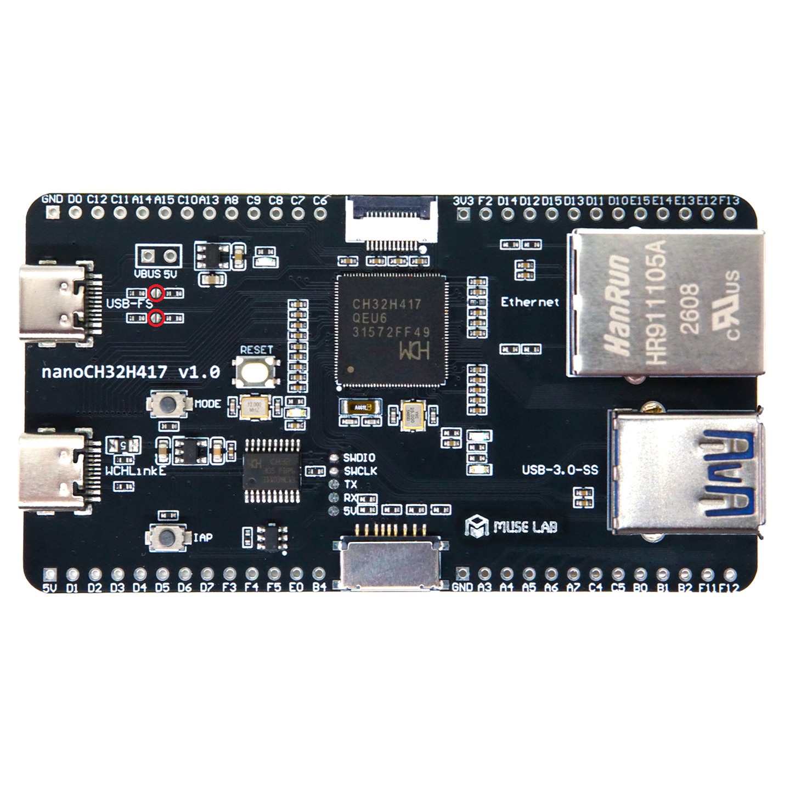

# CH32H417 PD Interrogator

[English](README.md) | 日本語

WCH CH32H417を使用したUSB Power Deliveryシンク／プロトコル調査用ファームウェアです。5 V契約を基本としてSPR・PPSの能力を解析し、対応電源ではEPRモードへの移行と分割されたEPR Source Capabilitiesの復元を行います。SOP'のケーブル識別通信も受動的に記録します。

WCH CH32H417 EVTサンプルを基にしており、現在は外付け5.1 kΩ CCプルダウン抵抗を使用するnanoCH32H417を対象としています。

## フォルダ構成

| フォルダ | 内容 |
| --- | --- |
| `firmware/USBPD_SNK/Common` | PDプロトコル、PHY、解析・デコード処理 |
| `firmware/USBPD_SNK/V3F` | V3F用MounRiverプロジェクト |
| `firmware/USBPD_SNK/V5F` | V5F用MounRiverプロジェクト |
| `vendor/wch/SRC` | WCH提供の起動処理、周辺機能、コア、リンカ関連ファイル |
| `tools` | 測定、レポート生成、測定設定の管理 |
| `docs` | 基板写真などの資料 |
| `captures` | 測定データと保存設定（Git管理対象外） |

このリポジトリだけでビルドに必要なソースが揃います。周囲のWCH EVT配布フォルダは不要です。以下のコマンドはリポジトリのルートで実行してください。

## 基板の準備：nanoCH32H417 V1.0

PDシンクとして使用する前に、`USB-FS` USB-Cコネクタ横の**写真で赤丸を付けた2カ所を、それぞれはんだでブリッジ**し、外付け5.1 kΩ CCプルダウン抵抗を有効にしてください。各赤丸内の2つのパッドを接続します。上下の赤丸同士をつなぐという意味ではありません。

はんだ付け前に、電源とすべてのUSBケーブルを外してください。



これはファームウェア設定ではなく、基板側で必要な準備です。写真はV1.0用です。別リビジョンの基板ではジャンパの配置を確認してください。この構成は外付けRdを前提としているため、回路を変更しない限り内蔵Rdを同時に有効にしないでください。

## ビルドと書き込み

MounRiver Studio 2で `firmware/USBPD_SNK/USBPD_SNK.wvsln` を開きます。

1. V3Fプロジェクトをビルドします。
2. V5Fプロジェクトをリビルドします。
3. `firmware/USBPD_SNK/V5F/obj/Merge.Bin` を書き込みに使用します。

解析用UARTの通信速度は460800 baudです。

旧 `EVT/EXAM` 構成から移行した場合は、新しい場所のソリューションを開き直し、両コアをリビルドしてIDEの生成物を更新してください。測定履歴・保存設定・お気に入りを引き継ぐには `captures` を丸ごとコピーし、dashboardの `ch32_capture_root` を移行先の `captures` に変更します。

## 測定を開始する

詳細ログとともに、バージョン付きの `@PD1` レコードをUARTへ出力します。Pythonツールは電源の挿し替えをセッションに分けて保存し、測定結果を集計します。

```powershell
python -m pip install -r tools/requirements.txt
python tools/pd_capture.py --list
python tools/pd_capture.py --port COM3 --source-id aohi-240w --source-manufacturer AOHI --source-model AOC-C022 --cable-id cable-01 --cable-attachment detachable
```

`COM3` は実際の接続ポートに置き換えてください。既定の通信速度は460800 baud、電源ポート名は `C1` です。通常はファームウェアのログをすべて表示します。完了・更新された要約だけを表示する場合は `--quiet` を指定します。

測定ごとにUARTの生バイト列とセッション別の結果を保存します。

```text
captures/YYYYMMDD_HHMMSS_SOURCE_MANUFACTURER_SOURCE_MODEL/
  capture.json
  SOURCE__CABLE__pd-interrogate__YYYYMMDD_HHMMSS.bin
  SOURCE__CABLE__pd-interrogate__YYYYMMDD_HHMMSS.log
  events.jsonl
  session_0001/
    SOURCE__CABLE__pd-interrogate__YYYYMMDD_HHMMSS__session-0001.log
    events.jsonl
    result.json
    summary.txt
```

`capture.json` と各 `result.json` の `artifacts.raw_log` がログファイル名を示します。`capture.json` には `artifacts.raw_binary` も保存します。旧形式の `raw.log` も読み込めます。保存済みの構造化ログをハードウェアなしで再処理するには、次を実行します。

```powershell
python tools/pd_capture.py --replay path/to/saved.log
```

## 測定設定の再利用

全オプションと使用例はヘルプで確認できます。

```powershell
python tools/pd_capture.py --help
python tools/pd_report.py --help
python tools/pd_capture.py --setup
```

`--setup` では保存済み設定を選択するか、新しい設定を登録できます。前回の設定も候補として表示されます。電源・ケーブルの識別子、メーカー・型番、ポート、長さ、AC入力、ファームウェア・基板のバージョン、CC抵抗、接続方向、メモを保存できます。測定開始前に設定を確認してください。

```powershell
python tools/pd_capture.py --save-profile bench-aohi --source-id aohi-240w --source-manufacturer AOHI --source-model AOC-C022 --cable-id cable-01 --firmware-version r70 --cc-resistance external-5.1k
python tools/pd_capture.py --profiles
python tools/pd_capture.py --profile bench-aohi --port COM3 --orientation ura
```

`--save-profile` だけでは測定を開始しません。同名の設定は更新されます。保存設定とともに明示したコマンドライン引数は、その測定に限って設定を上書きします。既存の測定情報から設定を登録することもできます。

```powershell
python tools/pd_capture.py --from-capture captures/EXISTING_CAPTURE_FOLDER --save-profile my-adapter
```

ログ名はASD-PD31と同じ `SOURCE__CABLE__CONDITION__YYYYMMDD_HHMMSS` 形式です。Windowsで使えない文字を置換し、`.` は `p` に変換します。`--source-name` と `--cable-name` で表示用の名前を指定でき、省略時は測定情報から生成します。`--measurement-condition` の既定値は `pd-interrogate` です。

長い名前はパス長に収まるよう短縮しますが、完全な情報はJSONに残します。同じ秒に複数の測定を開始した場合はフォルダ名に `_02`、`_03` などを付け、既存のデータを上書きしません。

## 履歴の検索とバックアップ

`captures/measurements.sqlite3` に測定設定と検索用のセッション索引を保存します。生ログとセッション別JSONを元の記録として保持し、ファイルを移動・改名せずに索引を更新できます。

```powershell
python tools/pd_report.py --history --source-id aohi-240w
python tools/pd_report.py --history --cable-id cable-01 --limit 100
python tools/pd_report.py --captures captures
```

索引の更新では、保存設定・結果ID・お気に入りを保持します。バックアップは `captures` 全体を対象にしてください。設定を含むデータベースと、お気に入りを含む `result_annotations.json` も必要です。索引の再構築だけでは保存設定を復元できません。

## レポートとResults Viewer

測定終了時には、次の集計ファイルも更新します。

| ファイル | 内容 |
| --- | --- |
| `captures/spec_table.html` | 電源・ケーブル・プロトコルの検索可能な一覧。各セッションの要約・JSON・生ログへのリンク付き |
| `captures/spec_table.csv` | 一覧のCSV版 |
| `captures/source_table.csv` | 電源IDごとの能力情報 |
| `captures/pdo_table.csv` | 広告されたPDOごとの値・生データ・電源フラグ |
| `captures/cable_table.csv` | ケーブルIDごとのSOP'識別情報と観測時の電源 |

CSVには測定条件、ファームウェア、基板、CC抵抗、接続方向、メモ、測定ID、生ログの相対パスも含みます。生成が完了してからファイルを置き換えるため、読み込み側に書きかけのCSVを渡しません。

`source_id` と `cable_id` はそれぞれ独立した機器の識別子です。セッションは測定時の組み合わせを記録します。`--label` は `--source-id` の別名です。フォルダ名にはメーカー・型番を使いますが、CSV・データベースの識別には安定した `source_id` を使います。

ケーブルIDのない古い測定では、取得したVDOから `auto-emarker-*` の識別子を作ります。個々のケーブルを区別する場合は `--cable-id` を指定してください。

電源直付けケーブルは `--cable-attachment captive` を指定します。省略されたケーブルのメーカー・型番は電源の値を引き継ぎ、ケーブルID未指定時は `source-id:captive` を生成します。電源表の `captive_cable_id` とケーブル表の `owner_source_id` で関連付けます。着脱式ケーブルは測定時の組み合わせのみを記録します。

`captures/spec_table.html` はブラウザで直接開けます。お気に入りを保存できるResults Viewerは次のコマンドで起動し、表示されたURLを開きます。既定値は `http://127.0.0.1:8766/` です。

```powershell
python tools/pd_report.py --captures captures --serve
```

完全な結果は `Valid`、取得失敗は `Failed`、部分的な結果は `Review` に分類します。お気に入りは測定の元データを変更せず `result_annotations.json` に保存します。CSVの `Result ID`、`Result Status`、`Favorite` 列により、ASD-PD31側でも注釈を引き継げます。これによって別々の測定を自動的に同一測定として扱うことはありません。

電源が任意の情報要求に応答した場合、PD/USBリビジョン、Source Capabilities Extendedの識別情報、Source Info、メーカー情報、コマンドごとの対応状況も表示します。

## 動作と検証

保存ログを利用したホストツールのテストは、測定ハードウェアなしで実行できます。

```powershell
python -m unittest discover -s tools -p "test*.py" -v
```

- SPR固定・PPS PDOの解析
- 任意のPPS契約・状態の確認と、その後の固定5 Vへの復帰
- EPRモードへの移行と分割されたEPR Source Capabilitiesの復元
- E-MarkerケーブルのSOP' Discover Identity ACKの受動的な解析
- 調査後のSOP Discover Identity・SVID・Modeの探索
- Soft/Hard Resetからの復旧とMessage IDの追跡
- CH32H417を再起動せずにケーブルの抜き差しへ対応
- UART経由の機械可読な電源・ケーブル・プロトコル情報
- GET_*情報要求と、Soft Reset・GoodCRC欠落・非対応時のフォールバック

要求の拒否、Soft Reset、ケーブル探索の失敗、電源側の制御判断などにより、一時的にSPRへ戻る電源があります。実際に広告された能力を記録し、EPRへの移行を繰り返し強制しません。

SOP'の取得は受動的なベストエフォート動作です。電源とケーブル間の通信を妨げるVCONN SwapやSOP'要求は送信しません。

## ライセンス

本プロジェクト独自のコード・ツール・文書は[MIT License](LICENSE)で提供します。
WCH提供コードとその派生部分には、元の著作権表示・利用条件が引き続き適用されます。MITの適用によってこれらの条件を置き換えるものではありません。
適用範囲と第三者コードの注意事項は[THIRD_PARTY_NOTICES.md](THIRD_PARTY_NOTICES.md)を参照してください。
